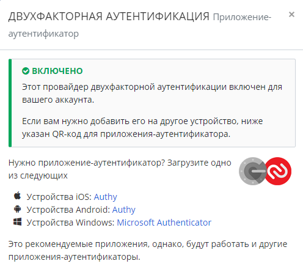
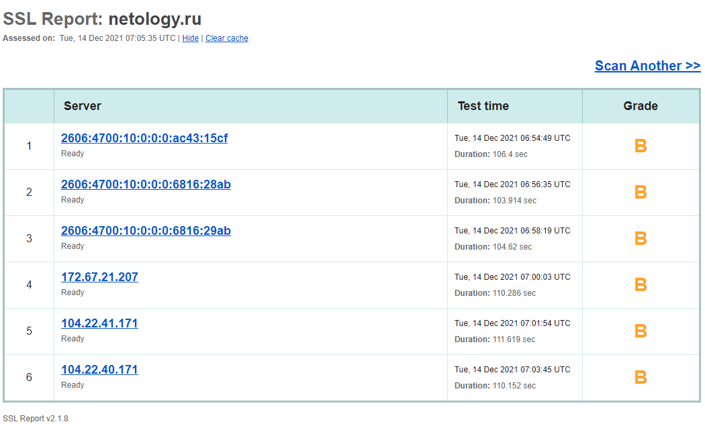
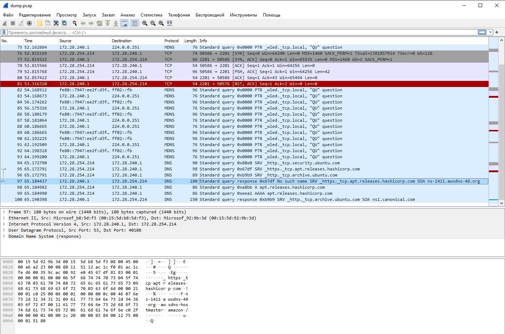

# Домашнее задание к занятию "3.9. Элементы безопасности информационных систем"

1. Установите Bitwarden плагин для браузера. Зарегестрируйтесь и сохраните несколько паролей.
- Выполнено
2. Установите Google authenticator на мобильный телефон. Настройте вход в Bitwarden акаунт через Google authenticator OTP.
- Выполнено

3. Установите apache2, сгенерируйте самоподписанный сертификат, настройте тестовый сайт для работы по HTTPS.
```shell
vagrant@netology1:~$ sudo apt update && sudo apt -y install apache2
vagrant@netology1:~$ sudo mkdir -p /etc/apache2/certs
vagrant@netology1:~$ sudo openssl req -x509 -newkey rsa:4096 -keyout /etc/apache2/certs/testkey.pem -out /etc/apache2/certs/testcert.pem -nodes -sha256 -days 365 -subj "/C=RU/ST=Moscow/L=Moscow/O=Company Name/OU=Test/CN=example.local"
Generating a RSA private key
.................++++
........................................................................................................................................++++
writing new private key to '/etc/apache2/certs/testkey.pem'
-----
vagrant@netology1:~$ sudo openssl x509 -text -noout -in /etc/apache2/certs/testcert.pem
Certificate:
    Data:
        Version: 3 (0x2)
        Serial Number:
            43:75:32:1f:f1:ba:9f:c8:18:aa:46:e8:f1:ea:9c:22:55:03:92:88
        Signature Algorithm: sha256WithRSAEncryption
        Issuer: C = RU, ST = Moscow, L = Moscow, O = Company Name, OU = Test, CN = example.local
        Validity
            Not Before: Dec 14 20:47:30 2021 GMT
            Not After : Dec 14 20:47:30 2022 GMT
        Subject: C = RU, ST = Moscow, L = Moscow, O = Company Name, OU = Test, CN = example.local
        Subject Public Key Info:
        <.....>
vagrant@netology1:~$ sudo sed -i 's/^127.0.0.1.*/&\texample.local/' /etc/hosts
vagrant@netology1:~$ cat << EOF | sudo tee /etc/apache2/conf-available/example-ssl.conf
> <VirtualHost *:443>
>     ServerName example.local
>     DocumentRoot /var/www/html
>     SSLEngine on
>     SSLCertificateFile certs/testcert.pem
>     SSLCertificateKeyFile certs/testkey.pem
> </VirtualHost>
>
> EOF
<VirtualHost *:443>
    ServerName example.local
    DocumentRoot /var/www/html
    SSLEngine on
    SSLCertificateFile certs/testcert.pem
    SSLCertificateKeyFile certs/testkey.pem
</VirtualHost>
vagrant@netology1:~$ sudo ln -s ../conf-available/example-ssl.conf /etc/apache2/conf-enabled/example-ssl.conf
vagrant@netology1:~$ sudo a2enmod ssl
Considering dependency setenvif for ssl:
Module setenvif already enabled
Considering dependency mime for ssl:
Module mime already enabled
Considering dependency socache_shmcb for ssl:
Enabling module socache_shmcb.
Enabling module ssl.
See /usr/share/doc/apache2/README.Debian.gz on how to configure SSL and create self-signed certificates.
To activate the new configuration, you need to run:
  systemctl restart apache2
vagrant@netology1:~$ apachectl configtest
AH00558: apache2: Could not reliably determine the server's fully qualified domain name, using 10.0.2.15. Set the 'ServerName' directive globally to suppress this message
Syntax OK
vagrant@netology1:~$ sudo systemctl restart apache2
```
```shell
vagrant@netology1:~$ curl -kvI https://example.local
*   Trying 127.0.0.1:443...
* TCP_NODELAY set
* Connected to example.local (127.0.0.1) port 443 (#0)
* ALPN, offering h2
* ALPN, offering http/1.1
* successfully set certificate verify locations:
*   CAfile: /etc/ssl/certs/ca-certificates.crt
  CApath: /etc/ssl/certs
* TLSv1.3 (OUT), TLS handshake, Client hello (1):
* TLSv1.3 (IN), TLS handshake, Server hello (2):
* TLSv1.3 (IN), TLS handshake, Encrypted Extensions (8):
* TLSv1.3 (IN), TLS handshake, Certificate (11):
* TLSv1.3 (IN), TLS handshake, CERT verify (15):
* TLSv1.3 (IN), TLS handshake, Finished (20):
* TLSv1.3 (OUT), TLS change cipher, Change cipher spec (1):
* TLSv1.3 (OUT), TLS handshake, Finished (20):
* SSL connection using TLSv1.3 / TLS_AES_256_GCM_SHA384
* ALPN, server accepted to use http/1.1
* Server certificate:
*  subject: C=RU; ST=Moscow; L=Moscow; O=Company Name; OU=Test; CN=example.local
*  start date: Dec 14 20:47:30 2021 GMT
*  expire date: Dec 14 20:47:30 2022 GMT
*  issuer: C=RU; ST=Moscow; L=Moscow; O=Company Name; OU=Test; CN=example.local
*  SSL certificate verify result: self signed certificate (18), continuing anyway.
> HEAD / HTTP/1.1
> Host: example.local
> User-Agent: curl/7.68.0
> Accept: */*
>
* TLSv1.3 (IN), TLS handshake, Newsession Ticket (4):
* TLSv1.3 (IN), TLS handshake, Newsession Ticket (4):
* old SSL session ID is stale, removing
* Mark bundle as not supporting multiuse
< HTTP/1.1 200 OK
HTTP/1.1 200 OK
< Date: Tue, 14 Dec 2021 20:50:35 GMT
Date: Tue, 14 Dec 2021 20:50:35 GMT
< Server: Apache/2.4.41 (Ubuntu)
Server: Apache/2.4.41 (Ubuntu)
< Last-Modified: Tue, 14 Dec 2021 20:07:36 GMT
Last-Modified: Tue, 14 Dec 2021 20:07:36 GMT
< ETag: "2aa6-5d320bd8d9387"
ETag: "2aa6-5d320bd8d9387"
< Accept-Ranges: bytes
Accept-Ranges: bytes
< Content-Length: 10918
Content-Length: 10918
< Vary: Accept-Encoding
Vary: Accept-Encoding
< Content-Type: text/html
Content-Type: text/html

<
* Connection #0 to host example.local left intact
```
4. Проверьте на TLS уязвимости произвольный сайт в интернете (кроме сайтов МВД, ФСБ, МинОбр, НацБанк, РосКосмос, РосАтом, РосНАНО и любых госкомпаний, объектов КИИ, ВПК ... и тому подобное).
- Выполнено
- https://www.ssllabs.com/ssltest/analyze.html?d=netology.ru&latest

5. Установите на Ubuntu ssh сервер, сгенерируйте новый приватный ключ. Скопируйте свой публичный ключ на другой сервер. Подключитесь к серверу по SSH-ключу.
```shell
vagrant@netology1:~$ ip -br a sh dev eth1
eth1             UP             172.28.128.10/24 fe80::a00:27ff:fed5:db88/64
vagrant@netology1:~$ ssh-keygen
Generating public/private rsa key pair.
Enter file in which to save the key (/home/vagrant/.ssh/id_rsa):
Enter passphrase (empty for no passphrase):
Enter same passphrase again:
Your identification has been saved in /home/vagrant/.ssh/id_rsa
Your public key has been saved in /home/vagrant/.ssh/id_rsa.pub
The key fingerprint is:
SHA256:U1Np+V5rWc8JAhnErpXK7GAwDO8BdNHHsxO9tTB2+fA vagrant@netology1
The key's randomart image is:
+---[RSA 3072]----+
|.. oo . +oo oo   |
| o.  . = O *+    |
|  =   . * @.=.   |
|   *   o * + E. o|
|  . + o S   ...o*|
|   . o = .    .=o|
|    . o       .  |
|       .         |
|                 |
+----[SHA256]-----+
vagrant@netology1:~$ ssh-copy-id vagrant@172.28.128.60
/usr/bin/ssh-copy-id: INFO: Source of key(s) to be installed: "/home/vagrant/.ssh/id_rsa.pub"
The authenticity of host '172.28.128.60 (172.28.128.60)' can't be established.
ECDSA key fingerprint is SHA256:wSHl+h4vAtTT7mbkj2lbGyxWXWTUf6VUliwpncjwLPM.
Are you sure you want to continue connecting (yes/no/[fingerprint])? yes
/usr/bin/ssh-copy-id: INFO: attempting to log in with the new key(s), to filter out any that are already installed
/usr/bin/ssh-copy-id: INFO: 1 key(s) remain to be installed -- if you are prompted now it is to install the new keys
vagrant@172.28.128.60's password:

Number of key(s) added: 1

Now try logging into the machine, with:   "ssh 'vagrant@172.28.128.60'"
and check to make sure that only the key(s) you wanted were added.

vagrant@netology1:~$ ssh vagrant@172.28.128.60
Welcome to Ubuntu 20.04.2 LTS (GNU/Linux 5.4.0-80-generic x86_64)

 * Documentation:  https://help.ubuntu.com
 * Management:     https://landscape.canonical.com
 * Support:        https://ubuntu.com/advantage

  System information as of Tue 14 Dec 2021 07:51:40 PM UTC

  System load:  0.07              Processes:             107
  Usage of /:   2.3% of 61.31GB   Users logged in:       1
  Memory usage: 30%               IPv4 address for eth0: 10.0.2.15
  Swap usage:   0%                IPv4 address for eth1: 172.28.128.60


This system is built by the Bento project by Chef Software
More information can be found at https://github.com/chef/bento
Last login: Tue Dec 14 19:47:14 2021 from 10.0.2.2
vagrant@netology2:~$ ip -br a sh dev eth1
eth1             UP             172.28.128.60/24 fe80::a00:27ff:fea0:e2ce/64
``` 
6. Переименуйте файлы ключей из задания 5. Настройте файл конфигурации SSH клиента, так чтобы вход на удаленный сервер осуществлялся по имени сервера.
```shell
vagrant@netology1:~$ mv .ssh/id_rsa{,_new}
vagrant@netology1:~$ mv .ssh/id_rsa{,_new}.pub
vagrant@netology1:~$ ssh vagrant@172.28.128.60
vagrant@172.28.128.60's password:
[Ctrl]+[C]

vagrant@netology1:~$ cat <<EOF > .ssh/config
> Host netology2
>     Hostname 172.28.128.60
>     PreferredAuthentications publickey
>     IdentityFile ~/.ssh/id_rsa_new
>     IdentitiesOnly yes
>
> EOF
vagrant@netology1:~$ ssh vagrant@netology2
Welcome to Ubuntu 20.04.2 LTS (GNU/Linux 5.4.0-80-generic x86_64)

 * Documentation:  https://help.ubuntu.com
 * Management:     https://landscape.canonical.com
 * Support:        https://ubuntu.com/advantage

  System information as of Tue 14 Dec 2021 08:01:24 PM UTC

  System load:  0.0               Processes:             110
  Usage of /:   2.3% of 61.31GB   Users logged in:       0
  Memory usage: 30%               IPv4 address for eth0: 10.0.2.15
  Swap usage:   0%                IPv4 address for eth1: 172.28.128.60


This system is built by the Bento project by Chef Software
More information can be found at https://github.com/chef/bento
Last login: Tue Dec 14 19:51:40 2021 from 172.28.128.10
vagrant@netology2:~$
```
7. Соберите дамп трафика утилитой tcpdump в формате pcap, 100 пакетов. Откройте файл pcap в Wireshark.
```shell
sudo tcpdump -c 100 -w ./dump.pcap
```

