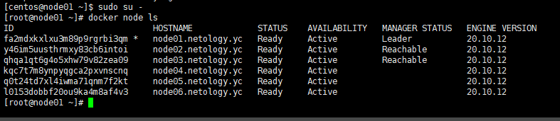
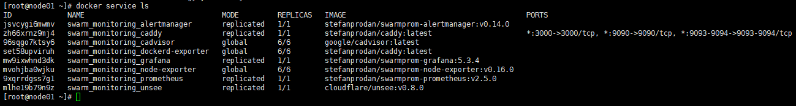

# Домашнее задание к занятию "5.5. Оркестрация кластером Docker контейнеров на примере Docker Swarm"

---

## Задача 1

Дайте письменые ответы на следующие вопросы:

- В чём отличие режимов работы сервисов в Docker Swarm кластере: replication и global?
- Какой алгоритм выбора лидера используется в Docker Swarm кластере?
- Что такое Overlay Network?

## Ответ 1

- global - будет гарантированно присутствовать на всех нодах кластера (как daemonset в кубере); replication - обеспечит заданное кол-во реплик сервиса на доступных нодах.
- Raft-алгоритм консенсуса
- виртуальная сеть. Docker Swarm использует её для прямого обмена между контейнерами. Overlay Network создает туннели по технологии VxLAN (Virtual eXtensible Local Area Network).

## Задача 2

Создать ваш первый Docker Swarm кластер в Яндекс.Облаке

Для получения зачета, вам необходимо предоставить скриншот из терминала (консоли), с выводом команды:
```
docker node ls
```

## Ответ 2

```
[root@node01 ~]# docker node ls
ID                            HOSTNAME             STATUS    AVAILABILITY   MANAGER STATUS   ENGINE VERSION
fa2mdxkxlxu3m89p9rgrbi3qm *   node01.netology.yc   Ready     Active         Leader           20.10.12
y46im5uusthrmxy83cb6intoi     node02.netology.yc   Ready     Active         Reachable        20.10.12
qhqa1qt6g4o5xhw79v82zea09     node03.netology.yc   Ready     Active         Reachable        20.10.12
kqc7t7m8ynpyqgca2pxvnscnq     node04.netology.yc   Ready     Active                          20.10.12
q0t24td7xl4iwma71qnm7f2kt     node05.netology.yc   Ready     Active                          20.10.12
l0153dobbf20ou9ka4m8af4v3     node06.netology.yc   Ready     Active                          20.10.12

```

## Задача 3

Создать ваш первый, готовый к боевой эксплуатации кластер мониторинга, состоящий из стека микросервисов.

Для получения зачета, вам необходимо предоставить скриншот из терминала (консоли), с выводом команды:
```
docker service ls
```

## Ответ 3

```
[root@node01 ~]# docker service ls
ID             NAME                                MODE         REPLICAS   IMAGE                                          PORTS
jsvcygi6mwmv   swarm_monitoring_alertmanager       replicated   1/1        stefanprodan/swarmprom-alertmanager:v0.14.0    
zh66xrnz9mj4   swarm_monitoring_caddy              replicated   1/1        stefanprodan/caddy:latest                      *:3000->3000/tcp, *:9090->9090/tcp, *:9093-9094->9093-9094/tcp
96sqgo7ktsy6   swarm_monitoring_cadvisor           global       6/6        google/cadvisor:latest                         
set58upviruh   swarm_monitoring_dockerd-exporter   global       6/6        stefanprodan/caddy:latest                      
mw9ixwhnd3dk   swarm_monitoring_grafana            replicated   1/1        stefanprodan/swarmprom-grafana:5.3.4           
mvohjba0wjku   swarm_monitoring_node-exporter      global       6/6        stefanprodan/swarmprom-node-exporter:v0.16.0   
9xqrrdgss7g1   swarm_monitoring_prometheus         replicated   1/1        stefanprodan/swarmprom-prometheus:v2.5.0       
mlhe19b79n9z   swarm_monitoring_unsee              replicated   1/1        cloudflare/unsee:v0.8.0                       
```
