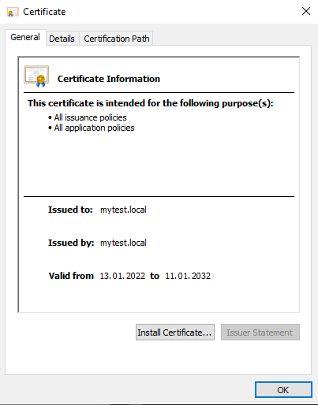
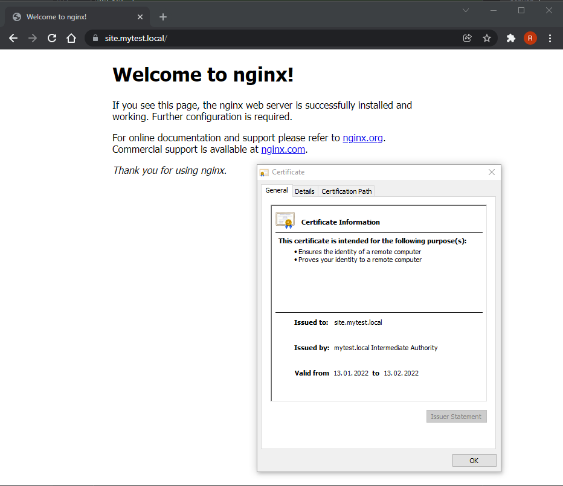
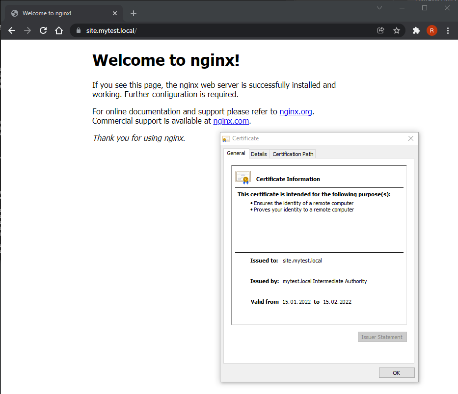
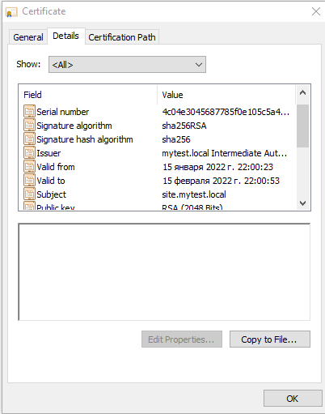
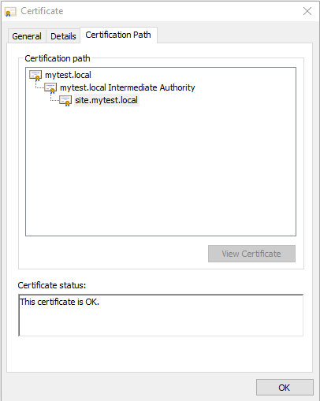

# Курсовая работа по итогам модуля "DevOps и системное администрирование"

Курсовая работа необходима для проверки практических навыков, полученных в ходе прохождения курса "DevOps и системное администрирование".

Мы создадим и настроим виртуальное рабочее место. Позже вы сможете использовать эту систему для выполнения домашних заданий по курсу

## Задание

1. Создайте виртуальную машину Linux.
```
Vagrant.configure("2") do |config|
  config.vm.box = "bento/ubuntu-20.04"
  config.vm.network "public_network", use_dhcp_assigned_default_route: true
  config.vm.provider "virtualbox" do |v|
    v.memory = 1024
    v.cpus = 2
  end
end

```
2. Установите ufw и разрешите к этой машине сессии на порты 22 и 443, при этом трафик на интерфейсе localhost (lo) должен ходить свободно на все порты.
```shell
vagrant@vagrant:~$ sudo su -
root@vagrant:~# apt install ufw
```
```
Reading package lists... Done
Building dependency tree
Reading state information... Done
ufw is already the newest version (0.36-6ubuntu1).
0 upgraded, 0 newly installed, 0 to remove and 0 not upgraded.
```
```shell
root@vagrant:~# ufw default deny incoming
```
```
Default incoming policy changed to 'deny'
(be sure to update your rules accordingly)
```
```shell
root@vagrant:~# ufw default allow outgoing
```
```
Default outgoing policy changed to 'allow'
(be sure to update your rules accordingly)
```
```shell
root@vagrant:~# ufw allow 22
root@vagrant:~# ufw allow 443
root@vagrant:~# ufw allow in on lo0
root@vagrant:~# ufw allow out on lo0
root@vagrant:~# ufw enable
```
```
Command may disrupt existing ssh connections. Proceed with operation (y|n)? y
Firewall is active and enabled on system startup
```
```shell
root@vagrant:~# ufw status verbose
```
```
Status: active
Logging: on (low)
Default: deny (incoming), allow (outgoing), disabled (routed)
New profiles: skip

To                         Action      From
--                         ------      ----
22                         ALLOW IN    Anywhere
443                        ALLOW IN    Anywhere
Anywhere on lo0            ALLOW IN    Anywhere
22 (v6)                    ALLOW IN    Anywhere (v6)
443 (v6)                   ALLOW IN    Anywhere (v6)
Anywhere (v6) on lo0       ALLOW IN    Anywhere (v6)

Anywhere                   ALLOW OUT   Anywhere on lo0
Anywhere (v6)              ALLOW OUT   Anywhere (v6) on lo0
```
3. Установите hashicorp vault ([инструкция по ссылке](https://learn.hashicorp.com/tutorials/vault/getting-started-install?in=vault/getting-started#install-vault)).
```shell
root@vagrant:~# curl -fsSL https://apt.releases.hashicorp.com/gpg | sudo apt-key add -
OK
```
```shell
root@vagrant:~# sudo apt-add-repository "deb [arch=amd64] https://apt.releases.hashicorp.com $(lsb_release -cs) main"
```
```shell
root@vagrant:~# sudo apt-get update && sudo apt-get install vault
```
```
Hit:1 http://archive.ubuntu.com/ubuntu focal InRelease
Hit:2 http://security.ubuntu.com/ubuntu focal-security InRelease
Hit:3 http://archive.ubuntu.com/ubuntu focal-updates InRelease
Hit:4 https://apt.releases.hashicorp.com focal InRelease
Hit:5 http://archive.ubuntu.com/ubuntu focal-backports InRelease
Reading package lists... Done
Reading package lists... Done
Building dependency tree
Reading state information... Done
The following NEW packages will be installed:
  vault
0 upgraded, 1 newly installed, 0 to remove and 0 not upgraded.
Need to get 69.4 MB of archives.
After this operation, 188 MB of additional disk space will be used.
Get:1 https://apt.releases.hashicorp.com focal/main amd64 vault amd64 1.9.2 [69.4 MB]
Fetched 69.4 MB in 9s (7,626 kB/s)
Selecting previously unselected package vault.
(Reading database ... 48328 files and directories currently installed.)
Preparing to unpack .../archives/vault_1.9.2_amd64.deb ...
Unpacking vault (1.9.2) ...
Setting up vault (1.9.2) ...
Generating Vault TLS key and self-signed certificate...
Generating a RSA private key
...++++
.......++++
writing new private key to 'tls.key'
-----
Vault TLS key and self-signed certificate have been generated in '/opt/vault/tls'.
```
```shell
root@vagrant:~# systemctl enable --now vault
root@vagrant:~# export VAULT_SKIP_VERIFY=true
root@vagrant:~# vault operator init
```
```
Unseal Key 1: mzp0PNcT9fHyFC4CCCImeC9GEKfsmZie1kEk9CNYKceR
Unseal Key 2: yDoFymIDutHTgJak+ob4hS7Y/Bk/aLqgSly90PYl8XxR
Unseal Key 3: RS3mv8/gYBA5RUgVByc3eYhKc94ri74KUS4xle3k9tBh
Unseal Key 4: 4Yu47SxjVbTWTLetsmPGlo+HoIzCwVK/OSVmLJe4SLu6
Unseal Key 5: gvtaCF8x9gSemW9xpiY6/iucHAFNMCrdRBdbDIWFZsKy

Initial Root Token: s.EW2z1xqUlwlLHTRZjp8H4TSZ

Vault initialized with 5 key shares and a key threshold of 3. Please securely
distribute the key shares printed above. When the Vault is re-sealed,
restarted, or stopped, you must supply at least 3 of these keys to unseal it
before it can start servicing requests.

Vault does not store the generated master key. Without at least 3 keys to
reconstruct the master key, Vault will remain permanently sealed!

It is possible to generate new unseal keys, provided you have a quorum of
existing unseal keys shares. See "vault operator rekey" for more information.
```
```shell
root@vagrant:~# vault operator unseal mzp0PNcT9fHyFC4CCCImeC9GEKfsmZie1kEk9CNYKceR
```
```
Key                Value
---                -----
Seal Type          shamir
Initialized        true
Sealed             true
Total Shares       5
Threshold          3
Unseal Progress    1/3
Unseal Nonce       794d4725-fe92-d30a-df20-7c3c58ad813d
Version            1.9.2
Storage Type       file
HA Enabled         false
```
```shell
root@vagrant:~# vault operator unseal yDoFymIDutHTgJak+ob4hS7Y/Bk/aLqgSly90PYl8XxR
```
```
Key                Value
---                -----
Seal Type          shamir
Initialized        true
Sealed             true
Total Shares       5
Threshold          3
Unseal Progress    2/3
Unseal Nonce       794d4725-fe92-d30a-df20-7c3c58ad813d
Version            1.9.2
Storage Type       file
HA Enabled         false
```
```shell
root@vagrant:~# vault operator unseal RS3mv8/gYBA5RUgVByc3eYhKc94ri74KUS4xle3k9tBh
```
```
Key             Value
---             -----
Seal Type       shamir
Initialized     true
Sealed          false
Total Shares    5
Threshold       3
Version         1.9.2
Storage Type    file
Cluster Name    vault-cluster-9961a4d0
Cluster ID      0fdfadad-91d3-f461-dc7f-6e0229d9c13f
HA Enabled      false
```
```shell
root@vagrant:~# vault login s.EW2z1xqUlwlLHTRZjp8H4TSZ
```
```
Success! You are now authenticated. The token information displayed below
is already stored in the token helper. You do NOT need to run "vault login"
again. Future Vault requests will automatically use this token.

Key                  Value
---                  -----
token                s.EW2z1xqUlwlLHTRZjp8H4TSZ
token_accessor       dtUtNEfCVLR9ngf9hBnQkbF9
token_duration       ∞
token_renewable      false
token_policies       ["root"]
identity_policies    []
policies             ["root"]
```
4. Cоздайте центр сертификации по инструкции ([ссылка](https://learn.hashicorp.com/tutorials/vault/pki-engine?in=vault/secrets-management)) и выпустите сертификат для использования его в настройке веб-сервера nginx (срок жизни сертификата - месяц).
```shell
root@vagrant:~# cat << EOF > mycapolicy
# Enable secrets engine

path "sys/mounts/*" {
  capabilities = [ "create", "read", "update", "delete", "list" ]
}

# List enabled secrets engine

path "sys/mounts" {
  capabilities = [ "read", "list" ]
}

# Work with pki secrets engine

path "pki*" {
  capabilities = [ "create", "read", "update", "delete", "list", "sudo" ]
}

EOF

```
```shell
root@vagrant:~# cat mycapolicy | vault policy write myca -
Success! Uploaded policy: myca
root@vagrant:~# vault policy list
default
myca
root
```
```shell
root@vagrant:~# vault token create -policy myca
```
```
Key                  Value
---                  -----
token                s.x04mjRtFvzMS9zkwIgRRCURa
token_accessor       34ttdNbZlrv8zexNwqFcyfam
token_duration       768h
token_renewable      true
token_policies       ["default" "myca"]
identity_policies    []
policies             ["default" "myca"]
```
```shell
root@vagrant:~# vault login
```
```
Token (will be hidden):
Success! You are now authenticated. The token information displayed below
is already stored in the token helper. You do NOT need to run "vault login"
again. Future Vault requests will automatically use this token.

Key                  Value
---                  -----
token                s.x04mjRtFvzMS9zkwIgRRCURa
token_accessor       34ttdNbZlrv8zexNwqFcyfam
token_duration       767h58m40s
token_renewable      true
token_policies       ["default" "myca"]
identity_policies    []
policies             ["default" "myca"]
```
```shell
root@vagrant:~# vault secrets enable pki
Success! Enabled the pki secrets engine at: pki/
root@vagrant:~# vault secrets tune -max-lease-ttl=87600h pki
Success! Tuned the secrets engine at: pki/
root@vagrant:~# vault write -field=certificate pki/root/generate/internal common_name="mytest.local" ttl=87600h > myca.crt
root@vagrant:~# vault write pki/config/urls issuing_certificates="$VAULT_ADDR/v1/pki/ca" clr_distribution_points="$VAULT_ADDR/v1/pki/clr"
Success! Data written to: pki/config/urls
root@vagrant:~# vault secrets enable -path=pki_int pki
Success! Enabled the pki secrets engine at: pki_int/
root@vagrant:~# vault secrets tune -max-lease-ttl=43800h pki_int
Success! Tuned the secrets engine at: pki_int/
```
```shell
root@vagrant:~# vault write -format=json pki_int/intermediate/generate/internal common_name="mytest.local Intermediate Authority" | jq -r '.data.csr' > pki_intermediate.csr
root@vagrant:~# vault write -format=json pki/root/sign-intermediate csr=@pki_intermediate.csr format=pem_bundle ttl="4380h" | jq -r '.data.certificate' > intermediate.cert.pem
root@vagrant:~# vault write pki_int/intermediate/set-signed certificate=@intermediate.cert.pem
Success! Data written to: pki_int/intermediate/set-signed
root@vagrant:~# vault write pki_int/roles/mytest allowed_domains="mytest.local" allow_subdomains=true max_ttl="840h"
Success! Data written to: pki_int/roles/mytest
```
5. Установите корневой сертификат созданного центра сертификации в доверенные в хостовой системе.


6. Установите nginx.
```shell
root@vagrant:~# apt -y install nginx
root@vagrant:~# mkdir -p /etc/nginx/cert
root@vagrant:~# vault write -format=json pki_int/issue/mytest common_name="site.mytest.local" ttl="744h" > /etc/nginx/cert/site.pem.json
root@vagrant:~# cat /etc/nginx/cert/site.pem.json | jq -r '.data.private_key' > /etc/nginx/cert/site-key.pem
root@vagrant:~# cat /etc/nginx/cert/site.pem.json | jq -r '.data.certificate' > /etc/nginx/cert/site.pem
root@vagrant:~# cat /etc/nginx/cert/site.pem.json | jq -r '.data.issuing_ca' >> /etc/nginx/cert/site.pem
```
7. По инструкции ([ссылка](https://nginx.org/en/docs/http/configuring_https_servers.html)) настройте nginx на https, используя ранее подготовленный сертификат:
  - можно использовать стандартную стартовую страницу nginx для демонстрации работы сервера;
  - можно использовать и другой html файл, сделанный вами;
```shell
root@vagrant:~# cat <<EOF > /etc/nginx/sites-available/mysite
server {
    listen 443 ssl;
    server_name site.mytest.local;
    
    ssl_certificate /etc/nginx/cert/site.pem;
    ssl_certificate_key /etc/nginx/cert/site-key.pem;

    ssl_protocols       TLSv1.1 TLSv1.2;
    ssl_ciphers         HIGH:!aNULL:!MD5;
    
    root /var/www/html;
    index index.html index.htm index.nginx-debian.html;
}
EOF
root@vagrant:~# ln -s /etc/nginx/sites-available/mysite /etc/nginx/sites-enabled/mysite
root@vagrant:~# nginx -t
```
```
nginx: the configuration file /etc/nginx/nginx.conf syntax is ok
nginx: configuration file /etc/nginx/nginx.conf test is successful
```
```shell
root@vagrant:~# systemctl restart nginx
```

8. Откройте в браузере на хосте https адрес страницы, которую обслуживает сервер nginx.

9. Создайте скрипт, который будет генерировать новый сертификат в vault:
  - генерируем новый сертификат так, чтобы не переписывать конфиг nginx;
  - перезапускаем nginx для применения нового сертификата.
```shell
root@vagrant:~# cat <<EOF > /root/nginx_cert_renew.sh
#! /usr/bin/env bash

export VAULT_SKIP_VERIFY=true
vault login s.x04mjRtFvzMS9zkwIgRRCURa
vault write -format=json pki_int/issue/mytest common_name="site.mytest.local" ttl="744h" > /etc/nginx/cert/site.pem.json
cat /etc/nginx/cert/site.pem.json | jq -r '.data.private_key' > /etc/nginx/cert/site-key.pem
cat /etc/nginx/cert/site.pem.json | jq -r '.data.certificate' > /etc/nginx/cert/site.pem
cat /etc/nginx/cert/site.pem.json | jq -r '.data.issuing_ca' >> /etc/nginx/cert/site.pem
systemctl reload nginx

EOF

```
10. Поместите скрипт в crontab, чтобы сертификат обновлялся какого-то числа каждого месяца в удобное для вас время.
```shell
root@vagrant:~# echo "0 22 15 * * root /bin/bash /root/nginx_cert_renew.sh" >> /etc/crontab
```


 | 
## Результат

Результатом курсовой работы должны быть снимки экрана или текст:

- Процесс установки и настройки ufw
- Процесс установки и выпуска сертификата с помощью hashicorp vault
- Процесс установки и настройки сервера nginx
- Страница сервера nginx в браузере хоста не содержит предупреждений 
- Скрипт генерации нового сертификата работает (сертификат сервера ngnix должен быть "зеленым")
- Crontab работает (выберите число и время так, чтобы показать что crontab запускается и делает что надо)
